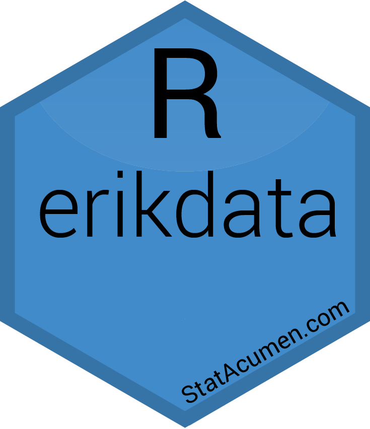

<!-- README.md is generated from README.Rmd. Please edit that file -->

```{r, include = FALSE}
knitr::opts_chunk$set(
  collapse = TRUE,
  comment = "#>",
  fig.path = "README-"
)
```

# erikdata <a href='https://github.com/erikerhardt/erikdata'></a>

<!-- badges: start -->
[](https://github.com/erikerhardt/erikdata/actions/workflows/check-standard.yaml)
<!-- badges: end -->

## Overview

Erik Erhardt's data library

* <strong><a href="https://erikerhardt.github.io/erikdata/">Documentation and Vignettes</a></strong>
* <a href="https://github.com/erikerhardt/erikdata/issues">Report Bug or Request Feature</a>

## Installation

```{r, eval = FALSE}
# The development version from GitHub
# install.packages("devtools")
devtools::install_github("erikerhardt/erikdata")
```

## Usage

```{r example}
library(erikdata)
erikdata_logo()
?`erikdata-package`
```

